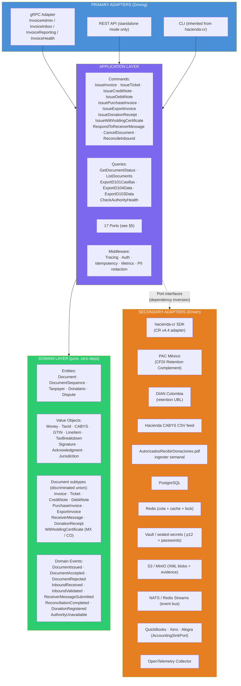
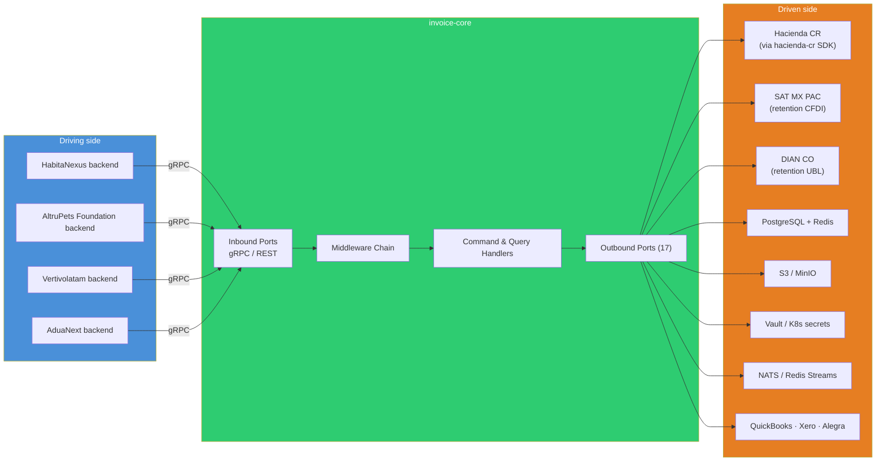
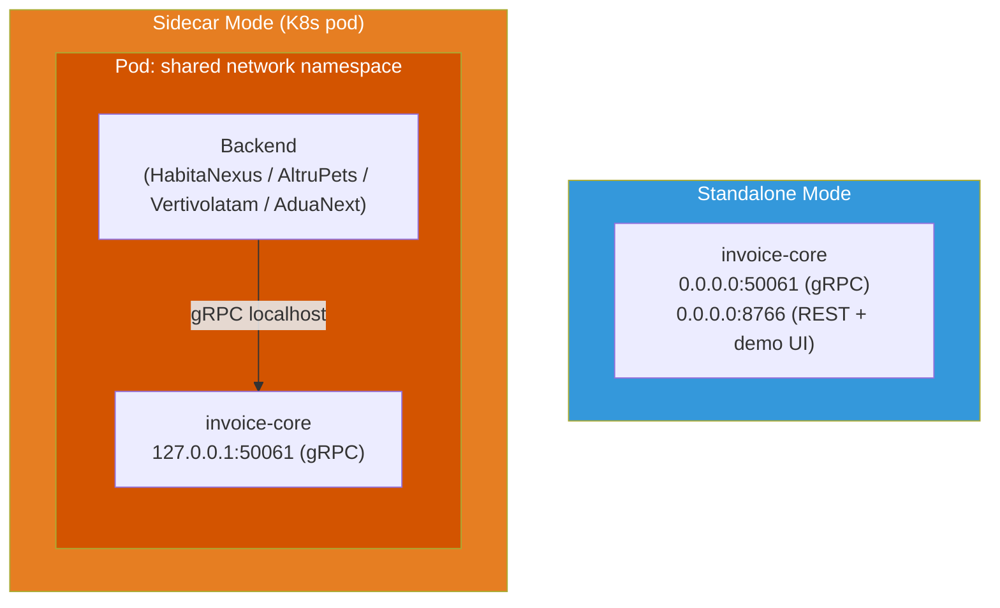
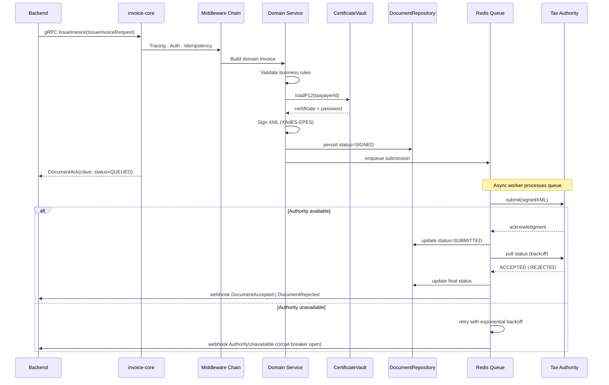
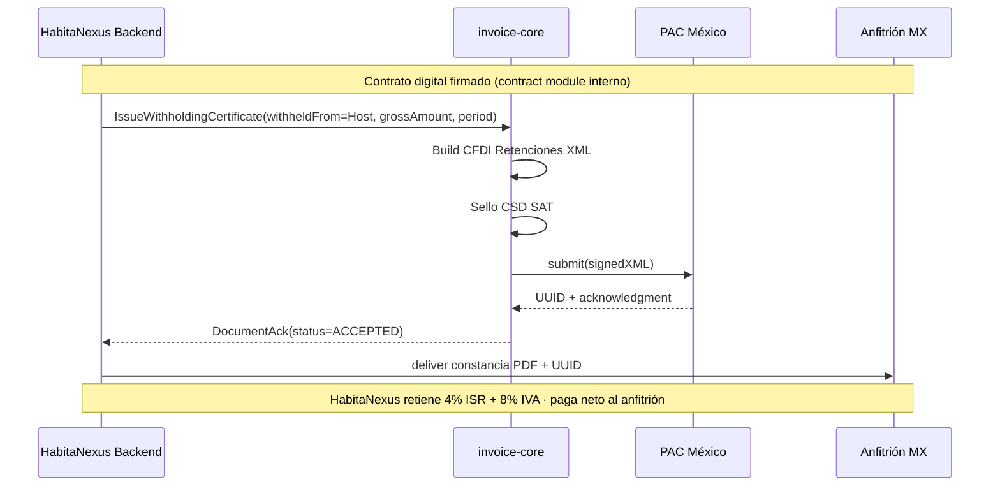
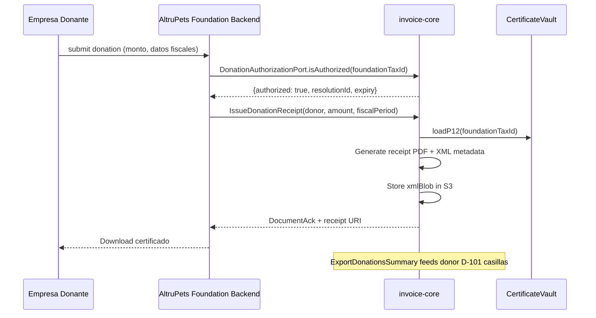
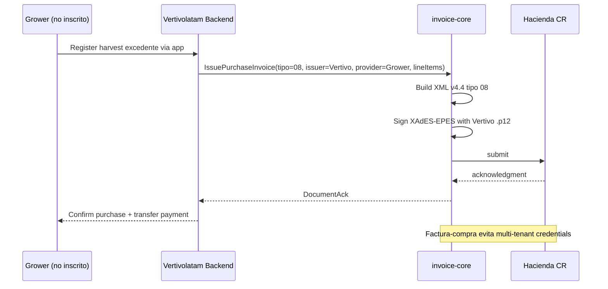
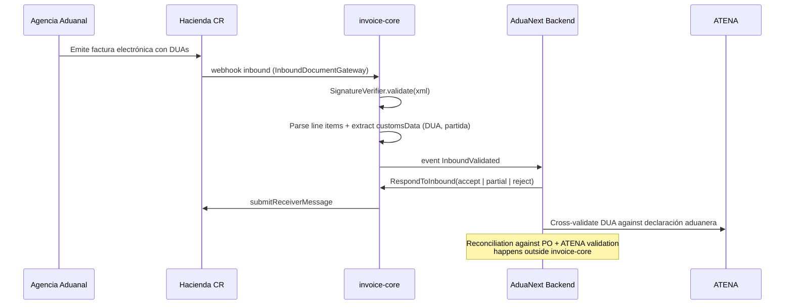

# invoice-core — Design Specification

**Fecha**: 2026-04-16
**Autor**: @lapc506 (Luis Andrés Peña Castillo / andres@dojocoding.io)
**Estado**: **APROBADO** por el autor tras ronda de brainstorming 2026-04-16.
**Licencia del diseño**: BSL 1.1 (igual que el código).
**Siguiente paso**: invocar `superpowers:writing-plans` para generar implementation plan con issues Linear.

---

## Documentos complementarios

- `/home/kvttvrsis/Escritorio/2026-04-16-invoice-core-hallazgos.md` — research completa (MoR, ATENA vs TRIBU-CR, donaciones, Vaki.co, fuentes).
- `/home/kvttvrsis/Escritorio/2026-04-16-core-governance-rubric.md` — rúbrica reusable de 5 criterios para decidir `-core` nuevos.
- `/home/kvttvrsis/Documentos/GitHub/habitanexus/business/spikes/06-contract-core-megaprompt.md` — mega-prompt para contract-core interno.

---

## 1. Contexto y motivación

`invoice-core` es la tercera librería compartida del ecosistema personal de @lapc506 — junto a `agentic-core` (Python, AI agent orchestration) y `marketplace-core` (TypeScript, product catalog + traceability). Llena el hueco arquitectónico explícito que `marketplace-core` declara: *"Tax reporting (TRIBU-CR, ISR — each project integrates)"*.

### Problema

Las 4 startups del portafolio (HabitaNexus, AltruPets, Vertivolatam, AduaNext) requieren:

- **Emisión y recepción** de comprobantes electrónicos v4.4 contra Hacienda CR (TRIBU-CR para fiscal; ATENA para aduanas integrado).
- **Constancias de retención MX** (HabitaNexus, art. 18-D Reforma Fiscal MX 2020) cuando opere con anfitriones mexicanos.
- **Documento soporte + retención en la fuente CO** (HabitaNexus, Dec. 1091/2020) en Colombia.
- **Recibos de donación deducible CR** (AltruPets Foundation autorizada por D-408).
- **Recepción y reconciliación** de facturas de proveedores (AduaNext — facturas de agencias aduanales con DUAs detalladas).
- **Resiliencia** contra caídas frecuentes de la API de Hacienda (`apis.gometa.org/status/` histórico).

Sin librería común, cada startup duplicaría: firma XAdES-EPES, clave numérica 50 dígitos, catálogo CABYS, retry + circuit breaker, OAuth2 ATV, etc.

### Valor sobre `hacienda-cr` SDK existente

`hacienda-cr` (DojoCodingLabs, TypeScript, MIT) cubre ya el SDK para CR v4.4. `invoice-core` lo **envuelve como adapter CR** dentro del patrón hexagonal y aporta:

1. **Arquitectura hexagonal** con ports + adapters, permitiendo swap por test o por jurisdicción.
2. **gRPC sidecar** — alineado con `agentic-core` y `marketplace-core`, con dual deployment (K8s sidecar o standalone Docker).
3. **Multi-país extensible**: CR hoy; MX retention + CO retention cuando HabitaNexus expanda.
4. **Recepción pasiva + Mensaje Receptor** estructurado.
5. **Catálogo CABYS ingerido y servido** centralizadamente.
6. **Cola + retry + circuit breaker** contra ATV/Hacienda.
7. **Recibos de donación deducible** (fuera de v4.4, formato propio).
8. **Observability** integrada (Prometheus + OTel + trace correlation con backend y agentic-core).
9. **Event-driven emission** hook (P3) para futuro de HabitaNexus Cairo/Madara.

---

## 2. Decisiones cerradas

| Decisión | Valor | Rationale |
|---|---|---|
| Alcance geográfico | **Opción B limitada** — CR v4.4 full + MX retention-only + CO retention-only | Multi-país real acotado; CFDI/DIAN completo solo si MoR strategy shift lo justifica |
| Lenguaje | **TypeScript 5.x estricto** | Alineación con `marketplace-core` + reuso directo de `hacienda-cr` |
| Runtime objetivo | **Node.js 22 LTS** | Consistente con `hacienda-cr` (Node 22+) |
| Flujo v1 | **Bidireccional completo** | AduaNext demanda inbound desde día uno |
| Multi-tenant credentials | **Single-tenant por operador** (diferido a P2) | Factura-compra tipo 08 resuelve growers/freelances sin multi-`.p12` |
| Licencia | **BSL 1.1** | Política personal del autor (memoria `feedback_bsl_license.md`) |
| Hospedaje | **`github.com/lapc506/invoice-core`** | Personal; migración a `CIHUBS/invoice-core` en discusión — no decidido ahora |
| Naming package npm | `@lapc506/invoice-core` inicial; alias `@cihubs/invoice-core` si migra | |
| GS1 / GTIN | Passthrough como string en line item | Ownership vive en `marketplace-core` |
| `accounting-core` | Rechazado en rúbrica | Adapters dentro de invoice-core como `AccountingSinkPort` |
| `filing-core` | Diferido a year 2 | Invoice-core v1 expone `FilingDataExportPort` |
| `contract-core` | Diferido a year 2-3 | HabitaNexus interno primero (spike 06 en habitanexus repo) |
| `compliance-core` | Siguiente `-core` después de invoice-core | 5/5 en rúbrica; urgente para HabitaNexus por Ley 8204 CR |

---

## 3. Arquitectura

### 3.1 Layered (Explicit Architecture)



### 3.2 Hexagonal (ports & adapters)



### 3.3 Deployment modes



Puertos escogidos intencionalmente distintos a `agentic-core` (`:50051` / `:8765`) para permitir **multi-sidecar** en el mismo pod de cada startup. `invoice-core` = `:50061` / `:8766`. `compliance-core` futuro = `:50071` / `:8767`.

### 3.4 Request flow (emisión activa)



---

## 4. Domain Model

### 4.1 Document discriminated union

```ts
export type DocumentType =
  | "INVOICE_CR"              // 01
  | "DEBIT_NOTE_CR"           // 02
  | "CREDIT_NOTE_CR"          // 03
  | "TICKET_CR"               // 04
  | "PURCHASE_INVOICE_CR"     // 08
  | "EXPORT_INVOICE_CR"       // 09
  | "RECEIVER_MESSAGE_CR"
  | "DONATION_RECEIPT_CR"
  | "WITHHOLDING_MX"
  | "WITHHOLDING_CO";

export type DocumentStatus =
  | "DRAFT"
  | "SIGNED"
  | "QUEUED"
  | "SUBMITTED"
  | "ACCEPTED"
  | "REJECTED"
  | "CANCELLED";

export interface BaseDocument {
  id: UUID;
  type: DocumentType;
  status: DocumentStatus;
  claveNumerica?: string;     // solo CR (50 dígitos)
  cfdiUUID?: string;          // solo MX
  dianCUFE?: string;          // solo CO
  issuer: Taxpayer;
  receiver: Taxpayer | ForeignReceiver;
  issuedAt: ISODateTime;
  fiscalPeriod: number;
  lineItems: LineItem[];
  taxBreakdown: TaxBreakdown;
  totals: DocumentTotals;
  relatedDocuments: DocumentReference[];
  xmlBlob: URI;               // pointer to S3
  acknowledgment?: Acknowledgment;
  auditTrail: DomainEvent[];
}

export interface Invoice extends BaseDocument {
  type: "INVOICE_CR";
  condicionVenta: CondicionVenta;
  medioPago: MedioPago[];
  plazoCredito?: number;
}

export interface PurchaseInvoice extends BaseDocument {
  type: "PURCHASE_INVOICE_CR";
  // Tipo 08 v4.4: comprador inscrito emite en nombre de proveedor no inscrito
  providerNotRegistered: {
    idType: "05_EXTRANJERO" | "00_NINGUNO";
    name: string;
    identifier?: string;
  };
}

export interface DonationReceipt extends BaseDocument {
  type: "DONATION_RECEIPT_CR";
  kind: "CASH" | "IN_KIND" | "SERVICE";
  amount: Money;
  appraisalRef?: URI;          // obligatorio si kind !== CASH
  donatario: {
    taxId: TaxId;
    name: string;
    resolutionId: string;
    resolutionExpiry: ISODate;
  };
  donor: {
    taxId: TaxId;
    name: string;
    countryCode: CountryCode;
  };
  deductibilityHint: {
    cap: "10% renta neta";
    jurisdiction: "CR";
  };
}

export interface WithholdingCertificate extends BaseDocument {
  type: "WITHHOLDING_MX" | "WITHHOLDING_CO";
  withheldFrom: Taxpayer;      // anfitrión local (residente)
  withheldBy: Taxpayer;        // HabitaNexus no residente
  grossAmount: Money;
  withholdings: Array<{
    concept: "ISR" | "IVA";
    rate: Decimal;
    amount: Money;
  }>;
  period: { from: ISODate; to: ISODate };
}

// ... (otras subtypes análogos)
```

### 4.2 LineItem con soporte multi-use-case

```ts
export interface LineItem {
  sequenceNumber: number;
  cabysCode: CABYS;            // obligatorio CR (13 dígitos)
  productCode?: {
    type: "01_SELLER" | "02_BUYER" | "03_INDUSTRY" | "04_GTIN";
    code: string;              // si type=04, formato GTIN-8/12/13/14
  };
  description: string;
  quantity: Decimal;
  unitOfMeasure: UnitCode;
  unitPrice: Money;
  discount?: Discount;
  taxes: TaxLine[];
  customsData?: CustomsLineData;   // P1 AduaNext (DUA, partida arancelaria)
  traceabilityRef?: URI;           // link a marketplace-core ISO 22005 trace
}

export interface CustomsLineData {
  duaNumber: string;
  tariffCode: string;              // partida arancelaria
  grossWeight: Decimal;
  netWeight: Decimal;
  origin: CountryCode;
  incoterms?: Incoterms;
}

export interface TaxLine {
  code: "01_IVA" | "02_SELECT" | "03_UNICO" | "04_TIMBRE" | ...;
  rate: 13 | 4 | 2 | 1 | 0;        // IVA CR
  exemption?: ExemptionReason;
  amount: Money;
}
```

### 4.3 State machine del documento

```
DRAFT
  → SIGNED          (after XAdES-EPES signing)
  → CANCELLED       (abandoned)

SIGNED
  → QUEUED          (enqueued for authority submission)
  → CANCELLED       (pre-submission cancellation via NC)

QUEUED
  → SUBMITTED       (sent to authority, awaiting ack)
  → CANCELLED       (queue purge under circuit breaker fail-open)

SUBMITTED
  → ACCEPTED        (authority ack OK)
  → REJECTED        (authority ack negative)

ACCEPTED
  → CANCELLED       (via nota de crédito emitted; related doc reference)

REJECTED | CANCELLED → terminal
```

Transiciones inválidas → `InvalidDocumentStateTransition` (typed error).

---

## 5. Ports Catalog (17 ports)

| # | Port | Responsabilidad | Adapters previstos |
|---|---|---|---|
| 1 | `DocumentRepository` | CRUD + query de Document | PostgreSQL |
| 2 | `SequenceRepository` | Consecutivo por sucursal / terminal / tipo | PostgreSQL |
| 3 | `CABYSRepository` | Catálogo CABYS Hacienda | PostgreSQL + CSV ingester |
| 4 | `TaxpayerRepository` | Datos fiscales del emisor | PostgreSQL |
| 5 | `CertificateVault` | Acceso a `.p12` + password | Vault / sealed-secrets / local FS |
| 6 | `TaxAuthorityPort` | `issue`, `queryStatus`, `submitReceiverMessage` | `HaciendaCRAdapter` · `PACMexicoAdapter` · `DIANColombiaAdapter` |
| 7 | `DonationAuthorizationPort` | Verifica donatarios autorizados | Hacienda PDF ingester semanal |
| 8 | `FilingDataExportPort` | Exporta data estructurada para TRIBU-CR | PostgreSQL aggregator |
| 9 | `InboundDocumentGateway` | Recepción de documentos entrantes | Hacienda webhook · IMAP · polling |
| 10 | `SignatureVerifier` | Valida XAdES-EPES / XAdES-BES / sello CSD SAT | Jurisdiction-specific |
| 11 | `ReconciliationPort` | Match inbound ↔ PO interno | In-memory + PostgreSQL |
| 12 | `OCRPort` (P2) | Extracción facturas legacy PDF | AWS Textract / Tesseract |
| 13 | `AppraisalPort` | Avalúo certificado para in-kind donations | Manual PDF upload (v1) |
| 14 | `CustomsDataPort` (P1) | Datos ATENA (DUA, partida) | HTTP client → AduaNext backend |
| 15 | `AccountingSinkPort` | Publica a ERPs externos | QuickBooks · Xero · Alegra |
| 16 | `EventBus` | Publish + subscribe domain events | NATS · Redis Streams |
| 17 | `ObservabilityPort` | Logs + spans + metrics | structlog + OTel SDK + Prometheus |

---

## 6. gRPC Services

### Proto skeleton (v1)

```proto
syntax = "proto3";
package invoice_core.v1;

service InvoiceAdmin {
  rpc IssueInvoice(IssueInvoiceRequest) returns (DocumentAck);
  rpc IssueTicket(IssueTicketRequest) returns (DocumentAck);
  rpc IssueCreditNote(IssueCreditNoteRequest) returns (DocumentAck);
  rpc IssueDebitNote(IssueDebitNoteRequest) returns (DocumentAck);
  rpc IssuePurchaseInvoice(IssuePurchaseInvoiceRequest) returns (DocumentAck);
  rpc IssueExportInvoice(IssueExportInvoiceRequest) returns (DocumentAck);
  rpc IssueDonationReceipt(IssueDonationReceiptRequest) returns (DocumentAck);
  rpc IssueWithholdingCertificate(IssueWithholdingRequest) returns (DocumentAck);
  rpc CancelDocument(CancelDocumentRequest) returns (DocumentAck);
  rpc GetDocumentStatus(GetDocumentStatusRequest) returns (DocumentStatus);
  rpc ListDocuments(ListDocumentsRequest) returns (stream Document);
}

service InvoiceInbox {
  rpc IngestInboundDocument(IngestInboundRequest) returns (InboundAck);
  rpc RespondToInbound(RespondToInboundRequest) returns (ReceiverMessageAck);
  rpc ListInbound(ListInboundRequest) returns (stream InboundDocument);
  rpc ReconcileWithPO(ReconcileRequest) returns (ReconciliationResult);
}

service InvoiceReporting {
  rpc ExportD101Casillas(ExportD101Request) returns (D101Data);
  rpc ExportD104Data(ExportD104Request) returns (D104Data);
  rpc ExportD103Data(ExportD103Request) returns (D103Data);
  rpc ExportDonationsSummary(ExportDonationsRequest) returns (DonationsSummary);
}

service InvoiceHealth {
  rpc CheckAuthorityHealth(CheckAuthorityRequest) returns (AuthorityHealthStatus);
  rpc GetQueueDepth(GetQueueDepthRequest) returns (QueueStats);
  rpc GetCircuitBreakerState(CircuitBreakerRequest) returns (CircuitBreakerStatus);
}
```

Proto versionado por namespace (`v1`, `v2`). Breaking changes → nuevo namespace + migration guide; coexistencia soportada.

---

## 7. Country Adapters

### 7.1 `HaciendaCRAdapter` — P0

Envuelve `@dojocoding/hacienda-sdk`. Responsabilidades:

- `buildClave` → `buildXML` → `sign` → `submit` → `poll status`.
- Soporta los 7 tipos v4.4 + Mensaje Receptor.
- Retry con exponential backoff ante 5xx o timeout > 10s.
- Fallback a **storage local Redis** cuando Hacienda está abajo; worker re-encola cuando recupera.
- Expone métricas: `invoice_authority_latency_seconds{authority="cr"}`, `invoice_authority_errors_total`.

### 7.2 `PACMexicoAdapter` — P2

Subset mínimo:

- **Solo Complemento de Retenciones e información de pagos** (no CFDI factura completa).
- Integración con PAC certificado (decisión v2: SW Smarter Web, Solución Factible o Finkok).
- Sello vía CSD SAT (HabitaNexus obtiene al registrar RFC extranjero por art. 18-D).
- Formato XML con namespace `retenciones.xsd v2.0`.
- Trigger de construcción: primer contrato HabitaNexus con anfitrión mexicano firmado.

### 7.3 `DIANColombiaAdapter` — P3

Subset mínimo:

- **Solo documento soporte en adquisiciones efectuadas a no obligados** + constancia de retención en la fuente.
- UBL 2.1 con XAdES-BES (distinta a XAdES-EPES de CR).
- Set de pruebas de habilitación DIAN requerido antes de producción.
- Trigger: primer contrato HabitaNexus en CO firmado.

### 7.4 Futuro CFDI/DIAN completo — P4

Reservado; se añade como `v2` servicios cuando alguna startup adopte modelo MoR directo (ver rúbrica governance).

---

## 8. Data flows por startup

### 8.1 HabitaNexus MX — Retención a anfitrión



### 8.2 AltruPets Foundation — Donación deducible



### 8.3 Vertivolatam — Factura Compra a grower no inscrito



### 8.4 AduaNext — Recepción factura aduanera detallada



---

## 9. Capability Matrix (prioridades)

| Capability | Prioridad | Fase |
|---|:---:|:---:|
| Emisión 01/02/03/04 CR | P0 | 1 |
| Emisión 08 Factura Compra CR | P0 | 1 |
| Mensaje Receptor CR | P0 | 1 |
| Recepción pasiva + reconciliación | P0 | 1 |
| Cola + retry + circuit breaker | P0 | 1 |
| CABYS ingestion + query | P0 | 1 |
| Cálculo IVA + retenciones | P0 | 1 |
| Observability stack | P0 | 1 |
| gRPC + REST + sidecar/standalone | P0 | 1 |
| Emisión 09 Exportación | P1 | 4 |
| Recibo Donación CR + `DonationAuthorizationPort` | P1 | 2 |
| `AppraisalPort` manual | P1 | 2 |
| `CustomsDataPort` (DUA line items) | P1 | 3 |
| `FilingDataExportPort` básico | P1 | 3 |
| Complemento Retenciones MX | P2 | 5 |
| Multi-tenant credentials | P2 | diferido |
| `OCRPort` facturas legacy | P2 | diferido |
| DIAN CO retenciones | P3 | 6 |
| Event-driven emission (blockchain bridge) | P3 | diferido |
| CFDI 4.0 MX completo | P4 | si MoR shift |
| DIAN CO completo | P4 | si MoR shift |

---

## 10. Testing strategy

- **Unit**: dominio puro con Vitest. >95% cobertura en `domain/`.
- **Integration**: adapters contra servicios reales en sandbox (Hacienda CR ATV sandbox, PAC MX sandbox, DIAN CO set de pruebas). PostgreSQL + Redis dockerizados.
- **Contract testing**: Pact entre invoice-core y cada backend consumidor. Proto versionado semánticamente.
- **Chaos**: Hacienda down simulado con toxiproxy. Verificar cola local + retry + circuit breaker + no-double-emit.
- **Compliance snapshot**: cada release valida XML emitido contra schema DGT-R-000-2024 v4.4 oficial. Golden files por tipo.
- **Load**: objetivo 100 docs/min por pod sostenido; burst 500/min.

---

## 11. Observability

Alineado con `agentic-core`:

- Logs: structlog JSON → stdout → Alloy → Loki.
- Traces: OTel SDK → OTLP → Tempo.
- Metrics: `/metrics` Prometheus scrape.
- Correlación `trace_id` en todas las operaciones.
- Métricas específicas:
  - `invoice_issued_total{type,jurisdiction,status}`
  - `invoice_authority_latency_seconds{authority,operation}` (histogram, buckets 0.1/0.5/1/2/5/10/30)
  - `invoice_queue_depth{authority}`
  - `invoice_circuit_breaker_state{authority}` (0=closed, 1=half-open, 2=open)
  - `invoice_inbound_received_total{source}`
  - `invoice_reconciliation_match_rate`
- Alertas:
  - Authority p95 latency > 10s durante 5 min.
  - Queue depth > 500 durante 10 min.
  - Circuit breaker abierto > 1 min.
  - Error rate > 5% en emisión.

---

## 12. Security model

- `.p12` + password ATV: jamás en config files; solo vía `CertificateVault`.
- PII redaction middleware en logs (cédulas, nombres de cliente).
- gRPC TLS en modo standalone (cert manejado por Ingress en K8s).
- gRPC unencrypted solo en sidecar loopback (`127.0.0.1:50061`).
- Auth interno: mTLS entre backend y sidecar (cert por startup).
- Webhooks outbound: HMAC-SHA256 con secret por startup.
- Audit log append-only con SHA-256 chaining para anti-tampering.
- CSP / secrets rotation: `.p12` renovable sin reinicio vía hot-reload.

---

## 13. Migration path desde `hacienda-cr`

### Paso 1: Sin breaking changes

- invoice-core v0.1 depende de `@dojocoding/hacienda-sdk@^1` sin modificarlo.
- Proyectos que ya usan `hacienda-cr` directo siguen funcionando.

### Paso 2: Refactor de shared primitives

- Mover helpers domain-neutral (XAdES, clave 50 dígitos, XML builders) a paquete nuevo `@lapc506/fiscal-primitives` si se comparten cross-adapter.
- `hacienda-cr` consume `fiscal-primitives`.

### Paso 3: Posible merge repo (condicional CIHUBS)

- Si se decide migrar bajo organización CIHUBS, `hacienda-cr` puede moverse a `invoice-core/adapters/cr/` vía `git subtree add` preservando history.
- No se decide ahora.

---

## 14. Roadmap por fases

### Fase 0 — Existente

`hacienda-cr` SDK + CLI + MCP publicado. Funciona.

### Fase 1 — invoice-core v0.1 MVP (4-6 semanas)

Entregables:

- Scaffold TS + hexagonal layout.
- Proto `v1` + servicios gRPC.
- `HaciendaCRAdapter` wrap de hacienda-cr para los 7 tipos.
- `DocumentRepository` · `SequenceRepository` · `CABYSRepository` (PostgreSQL).
- `CertificateVault` con Vault + sealed-secrets.
- `InboundDocumentGateway` básico (webhook Hacienda + polling).
- `SignatureVerifier` XAdES-EPES CR.
- Mensaje Receptor flow completo.
- Cola Redis + retry + circuit breaker.
- gRPC + REST + sidecar + standalone deployment.
- Dockerfile + docker-compose.
- Helm chart básico.
- Observability stack.
- Docs Zensical + MyST.
- BSL 1.1 LICENSE.

### Fase 2 — v0.2 AltruPets Foundation (2-3 semanas)

- `DonationAuthorizationPort` + adapter (ingesta PDF lista Hacienda).
- `AppraisalPort` manual PDF upload.
- `IssueDonationReceipt` end-to-end.
- `ExportDonationsSummary`.
- **Gate**: AltruPets Foundation constituida + autorizada por D-408 (ver spike `altrupets/business-model/foundation-dual-entity.md`).

### Fase 3 — v0.3 AduaNext inbound + customs (3-4 semanas)

- `CustomsDataPort`.
- `ReconciliationPort` contra POs internos.
- Reportes D-151 / D-152 clientes-proveedores.
- `FilingDataExportPort` básico.

### Fase 4 — v0.4 Vertivolatam export (1-2 semanas)

- `IssueExportInvoice` tipo 09.
- Multi-currency (USD, EUR además de CRC).
- Incoterms metadata.

### Fase 5 — v0.5 HabitaNexus MX retention (4-5 semanas)

- `PACMexicoAdapter`.
- `WithholdingCertificate` tipo MX.
- **Gate**: HabitaNexus registrado RFC extranjero en SAT.

### Fase 6 — v0.6 HabitaNexus CO retention (4-5 semanas)

- `DIANColombiaAdapter`.
- `WithholdingCertificate` tipo CO.
- **Gate**: HabitaNexus registrado ante DIAN CO.

### Fase 7 — v1.0 GA

- Multi-tenant credential management (si demanda real).
- Event-driven emission (si HabitaNexus Cairo/Madara live).
- Migration a CIHUBS si aprobada.

---

## 15. Anti-scope

- NO pagos (Kindo/Stripe/crypto → cada backend).
- NO catálogo de productos (`marketplace-core`).
- NO gestión de clientes/contactos.
- NO contabilidad / libro mayor (integra vía `AccountingSinkPort`).
- NO gestión de contratos (futuro `contract-core`; HabitaNexus interno primero).
- NO presentación automática D-101 (futuro `filing-core`).
- NO KYC/AML (futuro `compliance-core`).
- NO generación de GS1 GTINs (`marketplace-core`).
- NO integración directa con ATENA aduanas (AduaNext backend).

---

## 16. Riesgos

| Riesgo | Prob. | Impacto | Mitigación |
|---|:---:|:---:|---|
| Hacienda CR API caída prolongada | Alta | Alto | Circuit breaker + cola Redis + storage local + alertas Slack; fail-open con reintento |
| Schema v4.4 cambia pre-GA | Media | Medio | Golden files + CI validation contra schema oficial; parse with tolerance |
| PAC MX escogido sale del mercado | Baja | Medio | Adapter abstrae; swap de PAC es cambio localizado |
| Donatarios list PDF cambia formato | Media | Bajo | Ingester con schema flexible + fallback manual |
| `.p12` expira sin aviso | Alta (anual) | Alto | Certificate Vault con expiry monitoring + alerta 30/14/7 días |
| Multi-tenant se pide antes de P2 | Media | Medio | Diseño actual NO cierra puerta; extracción de `.p12` a per-tenant config es refactor contenido |

---

## 17. Spec self-review

- [x] Placeholder scan: sin TBD/TODO.
- [x] Internal consistency: arquitectura + proto + domain coinciden.
- [x] Scope focused: solo invoice-core; otros cores referenciados pero no diseñados.
- [x] Ambiguity: decisiones en §2 tienen valor concreto.
- [x] Deferred prioritizations marcadas P2/P3/P4 con criterio de promoción.
- [x] Mermaids validan en GitHub render.
- [x] Ports count consistent (17 en §3 y §5).
- [x] File paths absolutos a docs complementarios.

---

## 18. Próximos pasos

1. **APROBADO por @lapc506**. Este spec es vinculante para la implementación.
2. Ejecutar `superpowers:writing-plans` para convertir fases 1-6 en implementation plan con tareas específicas.
3. Crear workspace Linear + issues por fase (vía `make-no-mistakes:linear-projects-setup`).
4. `/make-no-mistakes:implement <issue-ID>` con issues específicos (no "todos" — por disciplina de worktree isolation + sequential branches).
5. **Paralelo**: constituir AltruPets Foundation CR en Q2 2026 (ver `altrupets/business-model/foundation-dual-entity.md`).

---

## Apéndice A — Relación con otros `-core`

| Consume de | Provee a |
|---|---|
| `hacienda-cr` SDK | `marketplace-core` consumers (GTIN en line items) |
| `marketplace-core` (ISO 22005 trace refs) | `agentic-core` (DocumentIssued events pueden disparar workflows AI) |
| (futuro) `compliance-core` (KYC check del receptor antes de emitir) | (futuro) `filing-core` (data para declaraciones) |

## Apéndice B — Fuentes regulatorias

- Costa Rica: Resolución DGT-R-000-2024 v4.4 · Ley 7092 ISR art. 8 inciso q · Res. DGT-R-03-2022 donaciones · Ley 8204 AML · TRIBU-CR (Hacienda Digital).
- México: Ley del IVA art. 18-D · art. 18-J · Reforma Fiscal 2020 · Anexo 27 RMF · CFDI Retenciones v2.0.
- Colombia: Decreto 1091/2020 · Estatuto Tributario art. 257 · Ley 527/1999 firma electrónica · DIAN UBL 2.1.

## Apéndice C — Referencias externas

- Explicit Architecture — Herbert Graca: https://herbertograca.com/2017/11/16/explicit-architecture-01-ddd-hexagonal-onion-clean-cqrs-how-i-put-it-all-together/
- `agentic-core` repo: `/home/kvttvrsis/Documentos/GitHub/agentic-core/`
- `marketplace-core` repo: `/home/kvttvrsis/Documentos/GitHub/marketplace-core/`
- `hacienda-cr` repo: `/home/kvttvrsis/Documentos/GitHub/hacienda-cr/`
- Hallazgos: `/home/kvttvrsis/Escritorio/2026-04-16-invoice-core-hallazgos.md`
- Plan operativo: `/home/kvttvrsis/Escritorio/2026-04-16-invoice-core-plan.md`
- Governance: `/home/kvttvrsis/Escritorio/2026-04-16-core-governance-rubric.md`
- contract-core mega-prompt: `/home/kvttvrsis/Documentos/GitHub/habitanexus/business/spikes/06-contract-core-megaprompt.md`
